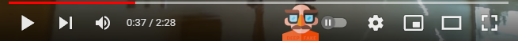

# AI DeepFake check
  
This is a browser extension to detect deep fakes.  
A new button is integrated in the YouTube player for this purpose.  


## Table of contents
- [Use](#use)
- [Development](#development)


## Use
After installation, the options page will open automatically.  
There a Modzy ApiKey must be entered.  
The page contains instructions for this.  

If you don't see this new icon in the player, please reload the page. #FIXME


## Development
I use [PARCEL](https://parceljs.org/) as build tool and install it globally with.
```shell
# install PARCEL
npm install -g parcel
```

Build local
```shell
# install dependencies
npm install

# build dist folder
npm run build:parcel
```
Then load the dist directory as an Chrome extension.

