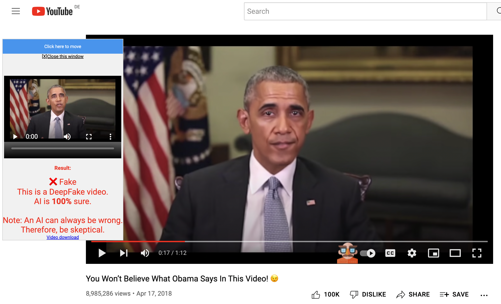

# AI DeepFake check
  
This is a browser extension to detect deep fakes.  
A new button is integrated in the YouTube player for this purpose.  


## Table of contents
- [Use](#use)
- [Development](#development)


## Use
After installation, the options page will open automatically.  
A [Modzy](https://www.modzy.com/) ApiKey must be entered.  
The page contains instructions for this.  

With this new button in the player you can start the video recording.  
  
Default recording is 5 seconds.  
After recording, the video is automatically sent to the AI for analysis.  
You can watch the recorded video in an extra player or download it.  
The result of the AI analysis is displayed in this player.  
Example:  
  

## Development
I use [PARCEL](https://parceljs.org/) as build tool and install it globally with
```shell
# install PARCEL
npm install -g parcel
```

Build local
```shell
# install dependencies
npm install

# build dist folder
npm run build:parcel
```
Then load the dist directory as an Chrome extension.

## Used images
Links to used images (CC) in this project:  
 ,  from [Icons8](https://icons8.de)  
 from [Freepik](https://www.flaticon.com/free-icon/fake_2185544?term=fake&page=2&position=64&page=2&position=64&related_id=2185544&origin=search)


## Code of conduct

[](https://github.com/deep2universe/DeepFakeChrome/blob/master/CODE_OF_CONDUCT.md)

## License

[Apache License 2.0](LICENSE)
