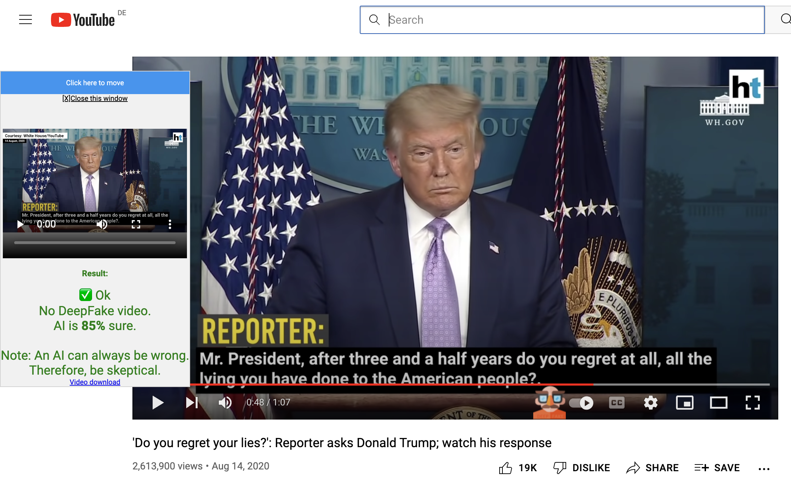
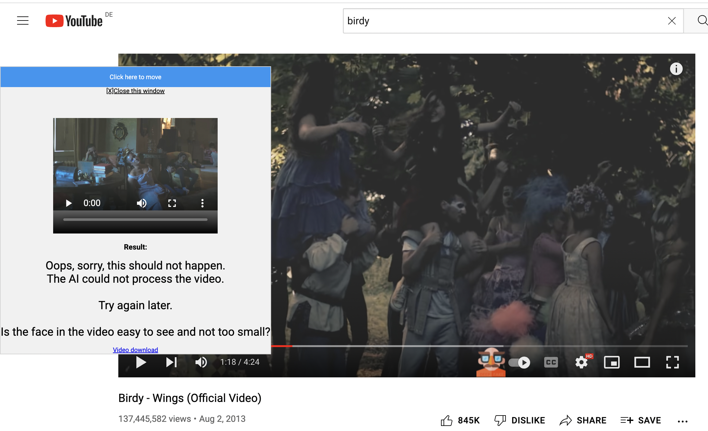
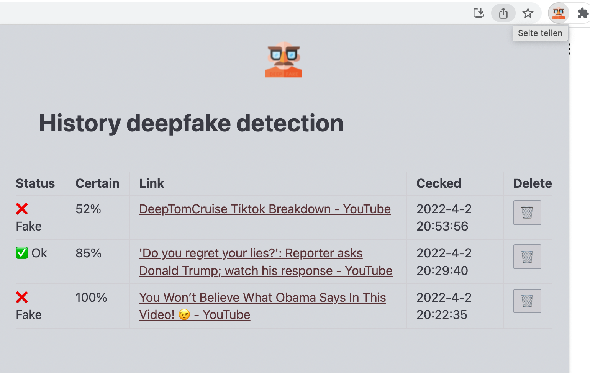

# AI DeepFake detection
  
This is a browser extension to detect deepfakes.  
A new button is integrated in the YouTube™ player for this purpose.  

## Introduction
Creating deepfake videos is getting easier and easier. You don't need technical skills anymore to make a manipulated video. You just follow an online instruction, that's enough.  
At the same time, the videos are becoming more and more realistic.  
Humans are far inferior to AI when it comes to recognizing deepfake videos. Therefore, it is now possible to mainipulate entire societies, since the naked eye can no longer recognize deepfakes.  
The question for everyone is how to protect themselves and others from this disinformation.  

Part of the solution is to critically question and check if what you see is plausible. In addition, however, we need technical tools and have to fight AI with AI.


## Table of contents
- [Use](#use)
- [Development](#development)


## Use
After installation, the options page will open automatically.  
A [Modzy](https://www.modzy.com/) ApiKey must be entered.  
The page contains instructions for this.  

With this new button in the player you can start the video recording.  
  
Default recording is 5 seconds.  
After recording, the video is automatically sent to the AI for analysis.  
You can watch the recorded video in an extra player or download it.  
The result of the AI analysis is displayed in this player.  

Example DeepFake:  
  

Example no DeepFake:  
  

Sometimes the AI can not process the video and you see this message:      
  


You can also ping the extension.    
The popup window shows your analysis history.  
The last analysis is shown on the top.  
You can also delete any analysis.  
This history is saved in your browser.  
  


## Development
I use [PARCEL](https://parceljs.org/) as build tool and install it globally with
```shell
# install PARCEL
npm install -g parcel
```

Build local
```shell
# install dependencies
npm install

# build dist folder
npm run build:parcel
```
Then load the dist directory as an Chrome extension.

## Used images
Links to used images (CC) in this project:   
 from [Freepik](https://www.flaticon.com/free-icon/fake_2185544?term=fake&page=2&position=64&page=2&position=64&related_id=2185544&origin=search)


## Code of conduct

[](https://github.com/deep2universe/DeepFakeChrome/blob/master/CODE_OF_CONDUCT.md)

## License

[Apache License 2.0](LICENSE)  

YouTube™ is a trademark of Google Inc.  
Use of this trademark is subject to Google Permissions.  

